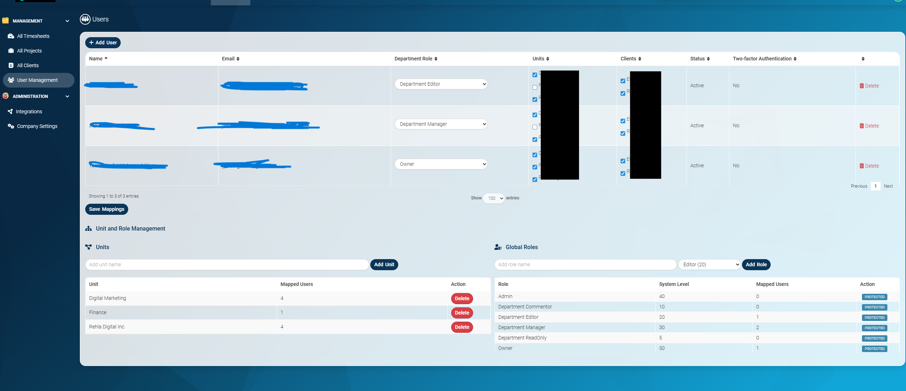

# Al Mudheer (The Manager) 💼
### High-Performance Data Analytics & Project Management

**Al Mudheer** is an open-source project and work management platform customized by **Rehla Digital**. Built to bridge the gap between high-level strategy and daily execution, it is designed to be as simple to use as Trello but as feature-rich as Jira. It serves as the ultimate open-source alternative to ClickUp, Monday.com, or Asana.

## Version

- **Current release:** `3.50.1`
- **Installation guide:** [INSTALL.md](INSTALL.md)
- **Access control docs:** [RBAC.md](RBAC.md)

---

## 🚀 ABSOLUTELY NO CATCH.
At Rehla Digital, we believe in the power of open-source community.
- **100% Open Source:** Access the full codebase without restrictions.
- **No Hidden Fees:** There are no "Pro" versions, no locked features, and no "Premium" tiers.
- **No Payment Page:** There isn't even a payment page for this code. Just download, host, and manage.

---

## 🌍 About [Rehla Digital](https://rehladigital.com)

Rehla Digital is a global technology partner specialized in driving digital transformation and innovative software solutions. We pride ourselves on delivering excellence to a diverse portfolio of international clients across:
- **North America:** Canada & USA
- **Asia:** India, Malaysia, Singapore
- **Middle East:** UAE

We built **Al Mudheer** to provide teams worldwide with a robust, data-driven tool that simplifies complex project management.

---

## ✨ Why Al Mudheer?
- **Inclusive Design:** Built with cognitive accessibility in mind (ADHD, Dyslexia, and Autism friendly) to ensure every team member can perform at their best.
- **Data-Driven Strategy:** Integrated analytics that connect your daily tasks directly to your long-term strategic goals.
- **Advanced Security:** Highly granular Role-Based Access Control (RBAC) with self-healing schemas for organizational stability.
- **Modern Experience:** A Tiptap-based rich text editor featuring slash commands, @mentions, and math formulas for seamless documentation.
- **Optimized Workflow:** Kanban boards with collapsible swimlanes and optimistic UI updates for a lag-free, high-performance experience.

---

## 🔍 Al Mudheer vs Leantime

| Area | Leantime Core | Al Mudheer (Rehla Digital) |
|---|---|---|
| Product Positioning | Lean project management foundation | Expanded to high-performance analytics + strategy execution |
| Organization Model | Standard team/project structure | Enhanced with global Unit/Client/Project mapping rules |
| Access Control (RBAC) | Baseline roles and permissions | Granular org-wide role model with self-healing RBAC schema |
| User Mapping | Typical user assignment patterns | One-role-per-user policy with multi-unit and multi-client mapping |
| Project Ownership Rules | Flexible defaults | Enforced one-client + one-unit project mapping |
| Upgrade Stability | Standard upgrade behavior | Hardened DB update flow and release/version alignment safeguards |
| UI/Workflow Enhancements | Core workflows | Custom Kanban and UX optimizations for faster day-to-day execution |
| Deployment Operations | Generic deployment approach | Production pipeline hardening and deployment smoke checks |

---

## 📸 Product Screenshots

---

## 📞 Reach Us
Have questions or want to learn more about how Rehla Digital supports global organizations? Reach out to us directly:

- **Email:** [git@rehladigital.com](mailto:git@rehladigital.com)
- **Website:** [rehladigital.com](https://rehladigital.com)

---

## License

Al Mudheer is based on the [Leantime](https://leantime.io) core and is licensed under AGPLv3.
